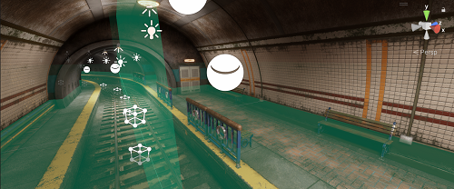

# Streaming

You can enable Probe Volume streaming to provide high quality lighting for games set in large open worlds.

At runtime, as your Camera moves, HDRP loads and uses only the sections of a Probe Volume that overlap visible geometry in your Scene.

The smallest section HDRP loads and uses is a 'cell', which is the same size as the largest [brick](probevolumes-concept.md) in a Probe Volume. You can influence the size of cells in a Probe Volume by [adjusting the density of Light Probes](probevolumes-showandadjust.md#adjust-light-probe-density).

To view the cells in a Probe Volume, use the **Display Cells** setting in [Rendering Debugger](rendering-debugger-window-reference.md#ProbeVolume).

 
The Rendering Debugger with **Display Cells** enabled.

## Enable streaming

To enable streaming, do the following:

1. Open the **Edit** menu and select **Project Settings** > **Quality** > **HDRP**.
2. Expand **Lighting** > **Light Probe Lighting**.
3. Enable **Enable Streaming**.

You can configure streaming settings in the same window. See [HDRP Asset](HDRP-Asset.md#Lighting) for more information.

## Compatibility with Asset Bundles

The underlying system used to support streaming causes limitation with regards to Asset Bundles and Addressables. Please see [this section for more information](probevolumes-settings.md#probe-volume-limitations-with-asset-bundles-and-addressables)

# Additional resources

* [Understand Probe Volumes](probevolumes-concept.md)
* [Frame Settings](frame-settings-reference.md)
