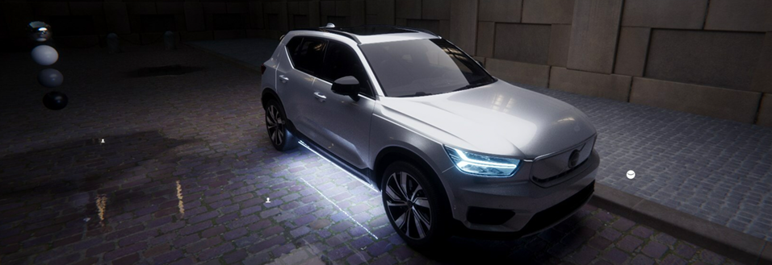
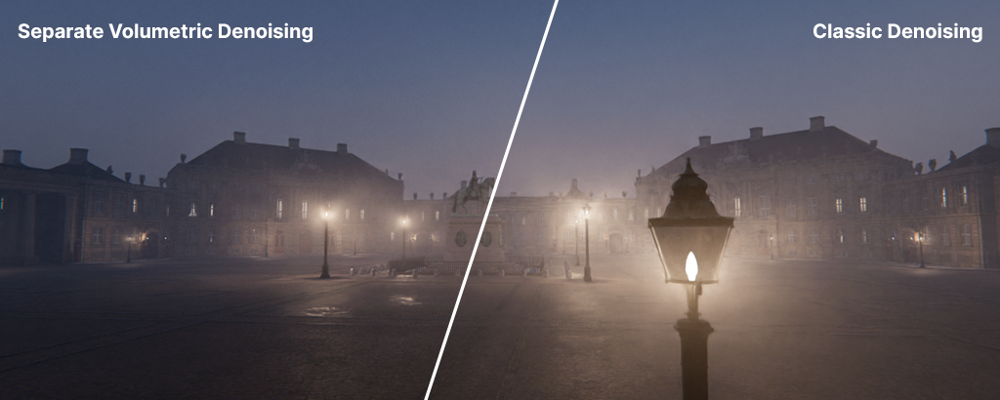
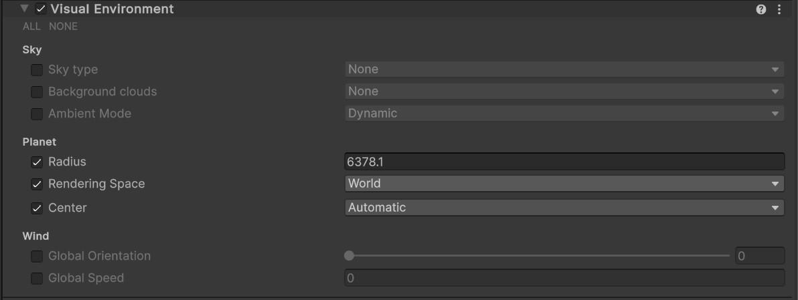
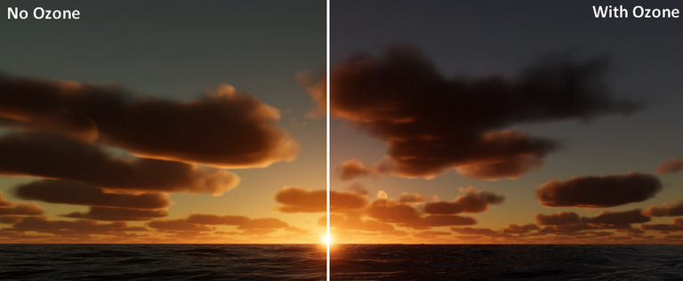
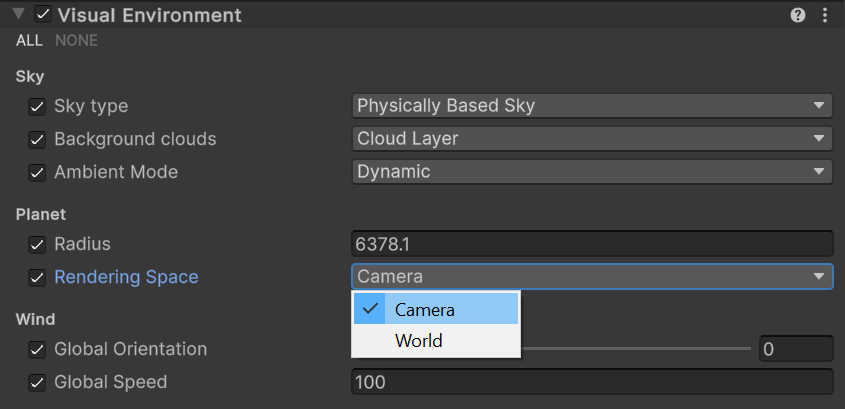
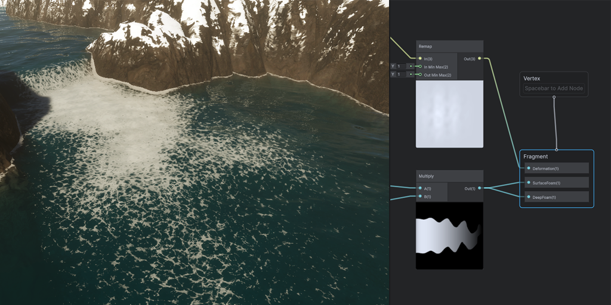
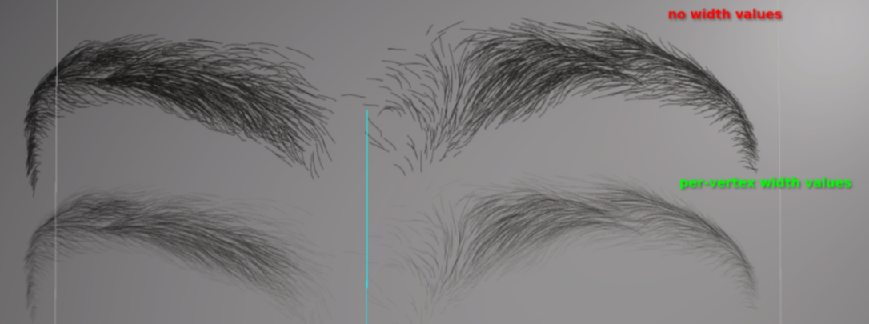
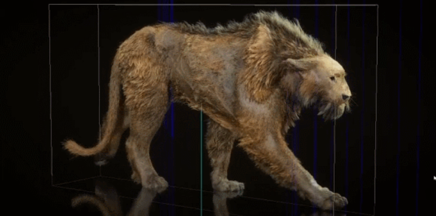

# What's new in HDRP version 17 / Unity 2023.3

This page contains an overview of new features, improvements, and issues resolved in version 17 of the High Definition Render Pipeline (HDRP), embedded in Unity 2023.3.

## Added

### Sky Occlusion

Adaptive Probe Volumes can now be enhance with [Sky Occlusion](https://docs.unity3d.com/Packages/com.unity.render-pipelines.high-definition@17.0/manual/probevolumes-skyocclusion.html) baking.

This add a way to perform dynamic time of day for exterior with a sun light on top of a static lighting scenario like for interior done with Adaptive Probe Volumes.

### Upscaler Technology

#### Fallback
New user interface for upscaler fallbacks. This new user interface will help the user set their preference in case a platform or API does not support such upscaler.

#### AMD FidelityFX 2.1 Super Resolution for Windows

Support for AMD FidelityFX 2.1 Super Resolution for Dx11, Dx12, Vulkan in any GPU vendor. The upscaler includes predefined upscaling modes and can easily be turned on in the HDRP settings by enabling the com.unity.amd internal package. This feature also includes the plugin and public API for programmability and accessibility of this effect on any scriptable object.

#### Spatial-Temporal Post-Processing

Support for the Spatial-Temporal Post-Processing (STP) upscaler has been added for all platforms. This upscaler produces higher quality visuals than the existing TAAU upscaler, but it only supports dynamic resolution when the hardware dynamic resolution mode is active. This means APIs such as DX11 are only capable of using STP when the resolution scale is forced to a fixed percentage.

### SpeedTree

Support of SpeedTree 9 files (.st9) exported by the SpeedTree Modeler application. Speedtree is now compatible with GPU Resident Drawer introduced in this release for improve CPU performance. In addition re-designs the SpeedTreeWind & SpeedTreeWindManager implementations to support multiple SpeedTree wind technologies as well as scalable CPU performance. Performance improvements depends on number of tree instances with wind, a speed up of x5-x10 CPU can be observe on MainThread and RenderThread depends on scenario.

### Path Tracing

#### Tube and Disc Area Lights

Disc and tube shaped area lights are now supported with path tracing.

#### Separate Volumetric Fog denoising

The HDRP path tracer now offers an option to denoise the volumetric fog effect separately from the full color output.

### Performance

#### GPU Resident Drawer with GPU Occlusion Culling

GPU Resident Drawer Leveraging the power of the [Batch Render Group API](https://docs.unity3d.com/2023.3/Documentation/ScriptReference/Rendering.BatchRendererGroup.html) that allows rigid game objects to be inserted into the BRG leading to significant main thread and render thread performance improvements for rendering. It allows to author your game using game objects and when processed they will be ingested and rendered via a special fast path that handles better instancing. The performance improvements are dependent on the scale of the scenes and the amount of instancing utilize. The more instanceable objects are rendered, the larger the benefits will be. This feature is specifically for standard MeshRenderes. It will not handle skinned mesh renderers, VFX Graphs, particle systems or similar effects renderers.

The extra GPU Culling functionality built on top of GPU Resident drawer allows for GPU-side culling of instances that do not contribute to the final image. This can help to improve GPU performance in scenes with heavy overdraw, and does not require any additional authoring to try out. With Rendering Debugger integration.

Enable GPU Resident Drawer and occlusion culling via checkbox on the SRP asset.

## Updated

### Adaptive Probe Volumes

Baking Adaptive Probe Volumes have been improved by using a new backend for generating probe data. This allows to generate probe lighting independently of lightmaps, as well as baking only a subset of the probes, or override the sample count for some of the probes. For example, when iterating on an indoor part of your scene, you can now select the sample count for this region only, and rebake the lighting as you edit the room with recomputing the whole scene.

A new toggle was also added to the Probe Volume Graphics settings to disable the use of Streaming Assets internaly for data storage. This results in APV baked data being compatible with Asset Bundles and Addressables at the cost of Disk Streaming.

### Environment effects

#### Planet parametrization

Planet parametrization for effects like fog, physically based sky and volumetric clouds have been moved to a shared place in the [Visual Environement override](https://docs.unity3d.com/Packages/com.unity.render-pipelines.high-definition@17.0/manual/visual-environment-volume-override-reference).

#### Physically Based Sky

The Physically Based sky has received a set of improvements and optimizations.
Multiscattering have been optimized by removing some of the precomputation steps which allows to update the sky settings every frame without considerable framerate drop, and improves the amount of light scattering in the atmosphere as seen from the surface when the sun is below the horizon.
The memory usage for the precomputed tables has also been reduced. Memory and performance can be increased further by setting the **Rendering Space** option to **Camera Space** in the Visual Environement, but the camera won't be able to leave the atmosphere anymore.

Additionally, the PBR sky now includes an ozone layer as part of the atmosphere model. This is especially noticeable when the sun is close to the horizon.

Finally, aerial perspective can now be enabled to simulate light absorption by particles in the atmosphere when looking at objects in the distance, such as mountains or clouds.

#### Volumetric clouds

The volumetric clouds are not clipped by the far plane anymore. Additionally, earth curvature control was removed as Planet settings are now controlled from the Visual Environement.
Local Clouds option is also removed, as far plane clipping does not happen anymore. To preserve the behavior of camera not being able to go inside the clouds, you should now set the **Rendering Space** option in **Camera Space** from the Visual Environement

#### Water System

Support of GameObject transform on Water Surfaces have been improved. Infinite Oceans and surfaces with Instanced Quad geometry can now be translated and rotated, and support setting a negative scale to flip the surface.
Added a Water Decal target for ShaderGraph in order to output water deformation and foam directly to the atlas, and avoid going through a CustomRenderTexture. Using the same graph also simplifies authoring when deformation and foam generation are linked.
Additionally foam is now animated to follow the current direction.

#### Volumetric Fog

The performance of the volumetric lighting has been improved.

### Render Graph

Render Graph now caches its compilation step from frame to frame, reducing the overall cost of rendering the frame. This option can be disabled in the Render Graph Graphics settings.

### Package Manager Samples

HDRP Package Manager samples have been reworked.
They are now more consistent and coherent across the different samples.
There is more sharing between pipelines and packages and have dependencies in samples themselves.
More explanations, links, files are included to better understand what is presented.

### Lens Flare

Lens Flares are now have improved XR support.

Additionally, a new ring procedural shape have been added as well as few other features to smooth out workflows:
- Support of Lens Flare asset as Lens Flare element, enabling recursion. 
- Support for radial gradient for procedural shapes.
- Support for light override to be able to have multiple flares affected by one light. 

### Hair

Improve the workflow for width of a line with the High Quality Line Rendering Feature. Users are now able to express the width in centimeter units on a per-vertex basis.

Character using per-vertex width values for peach fuzz with uniform width of 0.01cm

Also, a new rendering LOD mode based on screen coverage of a hair asset have been added to culls strands based on some kind of heuristic.
The screen coverage LOD mode allows an artist to define an animation curve, where the x-axis is the ratio between the screen space bounding-box of the hair instance to the viewport. The y-axis is the percentage of strands to render based on this ratio.

### Area Lights

Area light now used a "pillow" windowing function that is used for range attenuation of both rectangular and line lights. Both area (with cookie) and line lights now works correctly with every material type including Water, Hair, Fabric shaders, dual lobe SSS. In addition this version reduce the amount of CPU memory used to store LTC tables.

### Path Tracing

#### Include for Path Tracing checkbox 

Light sources now have a separate checkbox for being included in path tracing: `Include for Path Tracing`.

#### Variably sized Path Tracing Light List 

The HDRP Path tracer builds additional data structures to perform its rendering, including building a light list for light sampling. Before, the size of this light list was hardcoded, leading to artefacts when too many lights were present in the scene. It can now be updated through setting the `PathTracingMaxLightCount` setting in the [HDRP Config package](https://docs.unity3d.com/Packages/com.unity.render-pipelines.high-definition@17.0/manual/configure-a-project-using-the-hdrp-config-package.html).

#### Seed mode parameter in path tracing

The HDRP path tracer now allows you to choose a *Seed mode*. This determines the noise pattern used to path trace.

#### Lights

Box lights now behave correctly with path tracer
